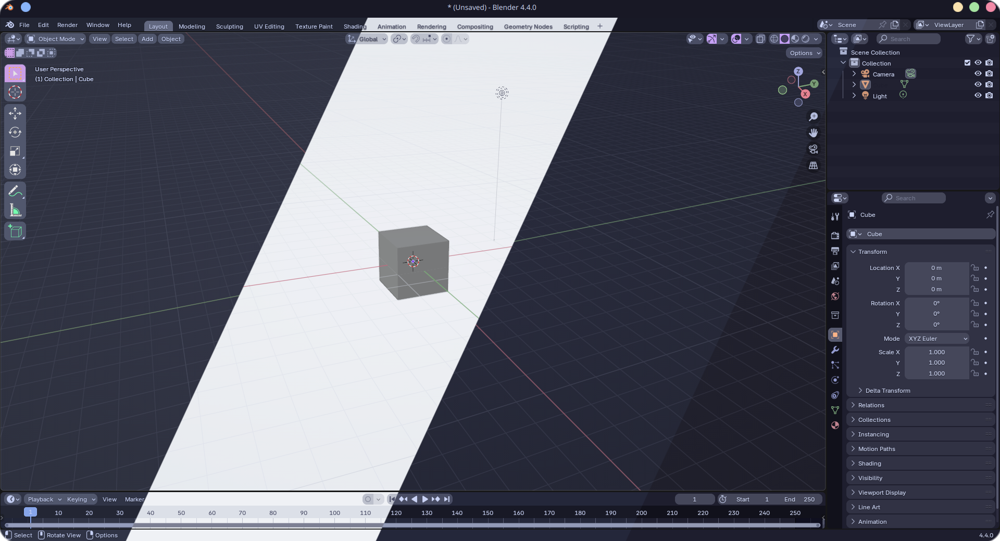

<h3 align="center">
	 
	
	Catppuccin for <a href="https://github.com/blender/blender">Blender</a>
	
</h3>

	
	
	

## Previews

## Usage

1. Download the flavor of your choice.
2. Open the app and go to **Edit** > **Preferences** > **Theme** > **Import theme**.
3. Select the downloaded flavor file.

## 💝 Thanks to

- [wintervoid](https://github.com/wintervoid)
- [Names](https://github.com/NamesCode)
&nbsp;

	

	Copyright &copy; 2021-present <a href="https://github.com/catppuccin" target="_blank">Catppuccin Org</a>

	

